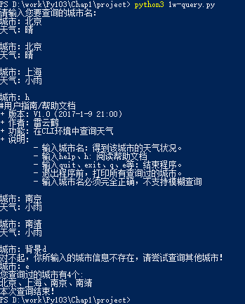

>作业要求实现一个在CLI环境运行的天气查询程序。
> + 打开数据文件，读取数据。
> + 输入城市，获取对应的天气。
> + 输入help，获得帮助文档。
> + 输入quit,exit，打印出所有查询过的城市，并退出程序。

# 解题思路
1. 搭框架：通过对任务的分析与分解，迅速提炼出需要解决的几个关键问题。
2. 抓细节：从知识点入手，各个击破。
3. 多迭代：反复测试与迭代修正。


# 需解决的关键问题
1. 打开文件和关闭文件
2. 读取数据，并转为dictionary
3. 交互过程中可能碰到的几种情况

## 打开文件和关闭文件

1. 打开文件进行操作后，必须要关闭文件。

	```open("weather_info.txt")```
	```"weather_into.txt".close()```

2. 有一个让我们偷懒的办法，就是使用with，实现打开文件与关闭文件的**“合二为一”**

```with open("weather_info.txt","r") as f:```

3. （运行时候才发现）如果仅通过上述两步，是无法解码的，补充编码方式后的最终代码：

``` with with open("weather_info.txt","r", encoding = "utf-8") as f:```

## 数据转换为dictionary

1. 创建空的dictionary

创建空dictionary很简单```city_weather_dict = {}```，但需要注意的是，创建list、tuple、dictionary、set等的区别。


|Data Type|Create|Add|Note|
|------ |---|----|----|
|list |list = []|list.append(*)|---|
|tuple |tuple= ()|---|---|
|dictionary|dict = {}|dict.setdefault(*,*)|---|
|set |set()|---|---|

>说明：上述表格仅为初步设计。由于目前还没彻底搞明白，待课程后期逐步完善


2. 从文件中读取数据，并转变成字典。

* 有逐行读取文件（返回这一行字符串）的功能。←开始意识到，对于文档熟悉是多么重要啊。

```for line in f```

* 读取出来的一行字符既含有“城市，天气”的格式，如何存储到字典的key和value呢？

+ 首先，用split()将分割成两个字符串，存储到list。

+ 然后，将list的两个值依次赋给dictionary。

```s = line.split(",") ```
```city_weather_dict.setdefault(s[0], s[1])```

## 交互中的几种可能情况

几种情况的代码实现都比较简单，但是分别有一些小的地方需要注意。

1. 输入quit,exit,q,e，退出程序（退出前打印所有查询过的城市）

需要特别注意的是：对退出的处理放在最前面，才能保证：无论用户何时输入退出命令，都能正常执行。另外，还要注意用户输入大小写的处理，需要统一处理为首字母大写。

2. 输入城市名，输出相应天气。

需要考虑的特殊情况是：当用户连续多次查询同样的城市，应该如何保存用户查询过的城市数据。

3. 输入help,h,打印帮助文档。

需要考虑的是：用户输入大小写的处理。

4. 输入信息有误，提示用户重新输入。

# 运行成果



